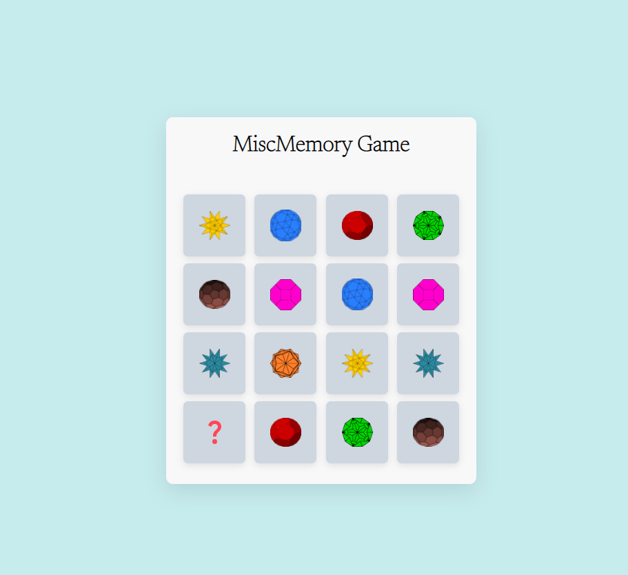

# Miscmem Game
Miscellaneous Memory Game. 
Memorize Fun, Random, &amp; Historical images.
#### Mismem project display <code>DOM javascript</code> concepts.

Tools used for PLanning & Developing <code>Miscmem Game</code>

The jewel images used for the back of the memory card game:
  - [jewel-1](images/img-1.png)
  - [jewel-2](images/img-2.png)
  - [jewel-3](images/img-3.png)
  - [question](images/que_icon.svg)
<br>
Figma was used to design the final visual presentation of Miscmem Game



background and card colors is from [flatUIcolors](https://flatuicolors.com)
background image color ** #c7ecee Hint of Ice Pack **
cards color ** #ced6e0 Twinkle Blue **
<br>
The images were placed in a function. The function is able to recognize the matching image by using an array method, by naming the images "images/img-8.png". <code>Math.random</code> is used to randomize the postion of the jewels. Review highlighted function below.

```
function shuffleCard() {
    matched = 0;
    disableDeck = false;
    cardOne = cardTwo = "";
    let arr = [1, 2, 3, 4, 5, 6, 7, 8, 1, 2, 3, 4, 5, 6, 7, 8];
    arr.sort(() => Math.random() > 0.5 ? 1 : -1);
    cards.forEach((card, i) => {
        card.classList.remove("flip");
        let imgTag = card.querySelector(".back-view img");
        imgTag.src = `images/img-${arr[i]}.png`;
        card.addEventListener("click", flipCard);
    });
}

shuffleCard();
```
