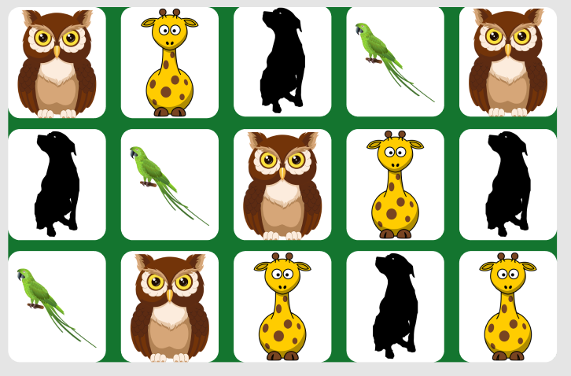

# Miscmem Game
Miscellaneous Memory Game. 
Memorize Fun, Random, &amp; Historical images.
#### Mismem project display <code>DOM javascript</code> concepts.

Tools used for PLanning & Developing <code>Miscmem Game</code>

The Open source animal & plant images used for the front of the memory card game:
  - [owl](https://cdn.pixabay.com/photo/2020/05/02/13/46/owl-5121468_960_720.png)
  - [giraffe](https://cdn.pixabay.com/photo/2012/05/07/01/54/giraffe-47523_960_720.png)
  - [rottweiler](https://cdn.pixabay.com/photo/2018/03/30/15/12/dog-3275593_960_720.jpg)
<br>
Figma was used to design the final visual presentation of Miscmem Game



background and card colors is from [flatUIcolors](https://flatuicolors.com)
<br>
The images were placed in an array function. The function is able to recognize the matching image by naming the images "images/img-8.png"

```
function shuffleCard() {
    matched = 0;
    disableDeck = false;
    cardOne = cardTwo = "";
    let arr = [1, 2, 3, 4, 5, 6, 7, 8, 1, 2, 3, 4, 5, 6, 7, 8];
    arr.sort(() => Math.random() > 0.5 ? 1 : -1);
    cards.forEach((card, i) => {
        card.classList.remove("flip");
        let imgTag = card.querySelector(".back-view img");
        imgTag.src = `images/img-${arr[i]}.png`;
        card.addEventListener("click", flipCard);
    });
}

shuffleCard();
```
